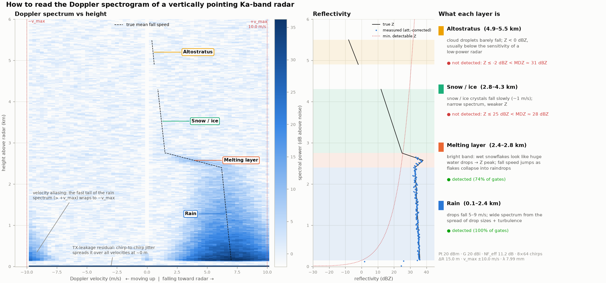
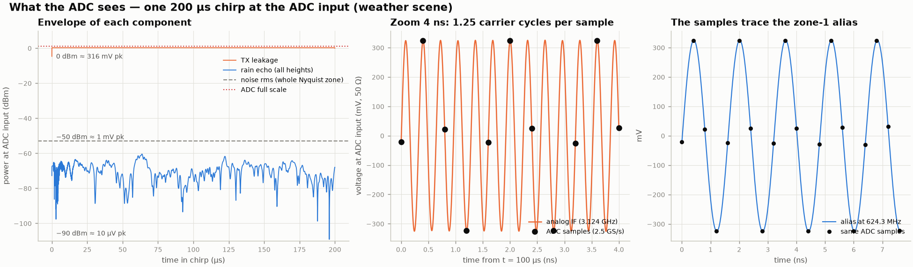
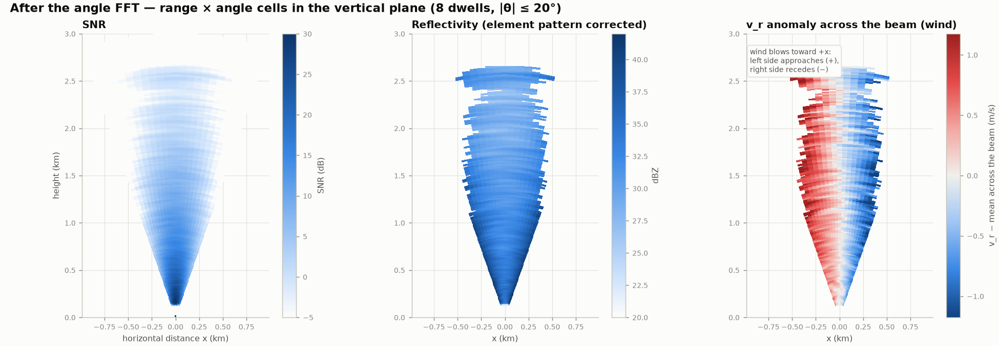

# Ka-band FMCW Weather Radar — Simulation (ZCU216)

Simulation แบบ end-to-end ของสายรับ (RX) ตาม [brief](docs/brief.md) ตั้งแต่สัญญาณสะท้อนจากฝนที่ antenna → ADMV1014 + 90° hybrid → BPF → RF-ADC ของ ZCU216 → DDC → digital dechirp → range/Doppler → Z, v, σv, rain rate → MIMO angle FFT → ลม
ทุก block เป็นฟังก์ชันแยกและมีกราฟของตัวเอง ส่วน processing (block 8–18) ใช้กับไฟล์ข้อมูลจริงจาก ZCU216 ได้โดยไม่ต้องแก้โค้ด

## เริ่มอ่านจากตรงไหน

| อยากรู้ | เปิด |
|---|---|
| สัญญาณที่ ADC หน้าตาเป็นอย่างไร และแต่ละขั้นทำอะไร (มีสมการ) | [`docs/signal_chain/index.html`](docs/signal_chain/index.html) (ดาวน์โหลดแล้วเปิดใน browser) |
| ภาพ 3D ของเรดาร์ ลำคลื่น ชั้นเมฆ และ MIMO | [`viz/radar_3d.html`](viz/radar_3d.html) (ดาวน์โหลดแล้วเปิดใน browser) |
| โจทย์ตั้งต้น | [`docs/brief.md`](docs/brief.md) |
| จะเอาข้อมูลจริงจาก ZCU216 มาใช้ | [`docs/real_data.md`](docs/real_data.md) |
| ไล่โค้ดทีละ block | [`notebooks/walkthrough.ipynb`](notebooks/walkthrough.ipynb) |

ทั้งสองหน้า HTML โหลด three.js / MathJax / ฟอนต์จาก CDN จึงต้องต่ออินเทอร์เน็ต

<p align="center">
  
</p>
<p align="center">
  
</p>
<p align="center">
  
</p>

## เริ่มใช้งาน

```bash
git clone <repo url> && cd <repo>
python3 -m venv .venv
.venv/bin/pip install -e ".[dev]"
.venv/bin/python -m pytest -q                                   # 31 tests
.venv/bin/python scripts/run_pipeline.py --config config/lab.yaml       # corner reflector 1 m
.venv/bin/python scripts/run_pipeline.py --config config/weather.yaml   # ฝน + bright band + เมฆ
.venv/bin/python scripts/run_pipeline.py --config config/weather_lna.yaml
.venv/bin/python scripts/validate.py                            # กราฟ validation ตาม brief §5
.venv/bin/python scripts/export_3d.py                           # สร้าง viz/radar_3d.html ใหม่
.venv/bin/python scripts/signal_walkthrough.py                  # กราฟอธิบายสัญญาณที่ ADC + SNR แต่ละขั้น
.venv/bin/python scripts/run_mimo.py                             # block 18: MIMO angle FFT, calibration, ลม (out/mimo/)
```

กราฟจะอยู่ใน `out/<config>/NN_<block>.png` และตัวเลขสรุปอยู่ใน `out/<config>/metrics.json`

## โครงสร้าง

```
config/            default.yaml (ค่าทั้งหมด) + lab / weather / weather_lna / lab_mimo / weather_mimo (override ผ่าน `base:`)
radar_sim/
  config.py        dataclass + Derived (แผนความถี่, Nyquist zone, NF cascade, v_max, warning)
  waveform.py      block 1   chirp generator
  scene.py         block 2   point target, weather layers, Zrnić spectral method, attenuation
  channel.py       block 3   delay, Doppler, TX→RX leakage
  frontend.py      block 4–6 mixer IQ imbalance, image-reject hybrid, noise, BPF
  adc.py           block 7–8 ADC (jitter, 14-bit, clipping) + DDC (ใช้ตัวเดียวกันกับข้อมูลจริง)
  baseband.py      complex-baseband equivalent ของ block 4–8 (เร็ว ใช้กับ chirp ส่วนใหญ่)
  iq.py            IQFrame = จุดแบ่ง simulation / processing
  processing/      block 9–17 dechirp, beat LPF, range FFT, clutter, Doppler, noise, Z, HB, Z–R, unfold
                   + mimo.py (block 18): virtual array, calibration, TDM compensation, angle FFT, DBS wind
  mimo.py          block 18 simulation: 4TX×4RX TDM channel, rain บนกริดระยะ×มุม, ลม
  io/capture.py    อ่านไฟล์ ZCU216 (raw IF หรือ DDC I/Q) → IQFrame, จัดตำแหน่ง chirp อัตโนมัติ
  plots.py         กราฟหนึ่งฟังก์ชันต่อ block
  interpret.py     spectrogram แบบมีคำอธิบายชั้นเมฆ
  linkbudget.py    radar equation สำหรับ validation
scripts/           run_pipeline, validate, export_3d, make_test_capture, process_capture, calibrate_corner
tests/             31 tests (range 1 m, SNR, IF≡baseband, aliasing, noise, Z/v/σv, unfolding, capture, MIMO)
notebooks/         walkthrough.ipynb ทีละ block
viz/               3D view (template + data จาก simulation)
docs/real_data.md  วิธีเก็บและประมวลผลข้อมูลจริง
```

## ผลที่ได้ (ค่า default)

| รายการ | ผล |
|---|---|
| Lab: corner reflector 1.00 m | peak ที่ 1.049 m (0.33 bin, bin = 15 cm); zero-pad ×8 → ±3 cm |
| Lab: SNR เทียบ radar equation | 78.7 vs 79.1 dB |
| IF path (10 GS/s analog → ADC → DDC) เทียบ baseband model | NMSE −74 dB (lab), −93 dB (weather) |
| Noise floor หลัง processing เทียบทฤษฎี | ต่างกัน < 0.1 dB (HS estimator ต่ำกว่า ~0.3 dB) |
| Weather: Z เทียบ truth (ที่ถูก attenuate และถ่วงด้วย range response) | bias −0.14 dB, std 0.77 dB |
| Weather: v RMSE ในฝน | 0.15 m/s |
| Velocity unfolding (T_rep 400 µs, v_max 5 m/s) | กู้ความเร็วฝน 6–7 m/s ได้ครบ โดยใช้ยอด melting layer เป็น reference |

## สิ่งที่ simulation บอกเกี่ยวกับฮาร์ดแวร์

1. **TX leakage คือปัญหาใหญ่ที่สุด** ถ้า Pt = 20 dBm และ isolation 40 dB จะได้ leakage ที่ ADC ≈ 0 dBm ซึ่งห่าง full scale แค่ 1 dB และแรงกว่า echo ฝนทั้งหมดรวมกันประมาณ 69 dB (`05_noise.png`, `03_channel.png`) ต้องวัด isolation จริงก่อน
2. **ADC noise มีผลต่อ NF** เมื่อ gain ถึง ADC เป็น 20 dB, NSD ของ ADC (−150 dBFS/Hz, สมมติฐาน) ทำให้ NF จาก 10.0 dB กลายเป็น 11.2 dB
3. **ความไว:** ที่ Pt 20 dBm โดยไม่มี LNA ระบบเห็นฝนและ bright band ได้ถึงประมาณ 2.7 km แต่ไม่เห็นหิมะ (MDZ ≈ 28 dBZ ที่ 3.5 km) และไม่เห็นเมฆ altostratus ที่ 5 km (−2 dBZ เทียบกับ MDZ ≈ 31 dBZ) (`18_spectrogram_interpretation.png`)
   ถ้าใส่ LNA (NF 3 dB) และเฉลี่ย 0.4 s ก็เห็นหิมะได้บางส่วน แต่เมฆสูงยังต้องเพิ่ม sensitivity อีกราว 25 dB
4. **แผน LO:** PLL 8.54 GHz ทำให้ chirp 1 GHz คร่อมขอบ zone 3/4 ส่วนค่า integer-N ที่ใกล้ 8.594 GHz ที่สุดคือ N = 1119 (8.59392 GHz) ซึ่งทำให้ IF อยู่กลาง zone 3 พอดี (`v2_nyquist_aliasing.png`)
5. **SNR ต่อ chirp** ต่ำกว่า link budget ใน brief ราว 9 dB เพราะ noise bandwidth ต่อ chirp คือ 1.5/200 µs (7.5 kHz) ไม่ใช่ 1 kHz ส่วนที่ชดเชยได้คือการเฉลี่ยหลาย chirp/dwell ซึ่งช่วยลด detection threshold (`v1_snr_vs_range.png`)

## กราฟแต่ละ block (`out/weather/`)

| ไฟล์ | Block |
|---|---|
| `01_waveform` | DAC IF chirp, instantaneous frequency, spectrogram |
| `02_scene` | ground truth Z, v, σv, PIA ตามความสูง |
| `03_channel` | leakage เทียบ echo |
| `04_downconverter` | I/Q ก่อน hybrid (wanted vs image), test tone image rejection, real IF |
| `05_noise` | noise cascade และ level diagram ที่ ADC |
| `06_bpf` | สเปกตรัมก่อน/หลัง BPF และ Nyquist zone |
| `07_adc` | การพับลง zone 1, zone map, histogram ของ code |
| `08_ddc`, `08b_if_vs_baseband` | DDC output, filter, data rate, การตรวจ IF เทียบ baseband |
| `09_dechirp`, `10_beat_lpf` | beat spectrogram, LPF + decimation |
| `11_range_fft`, `12_clutter_removal` | range profile, range–chirp matrix, ก่อน/หลังตัด leakage |
| `13_doppler`, `14_detection` | range–Doppler, pulse-pair, noise estimate, mask |
| `15_reflectivity`, `16_attenuation`, `17_rain_rate` | Z เทียบ truth, Hitschfeld–Bordan, Z–R |
| `18_spectrogram_interpretation` | spectrogram พร้อมคำอธิบายแต่ละชั้น |

## ข้อมูลจริง

อ่าน [docs/real_data.md](docs/real_data.md) สรุปสั้น ๆ:

```bash
.venv/bin/python scripts/make_test_capture.py --config config/lab.yaml --out data/test_lab   # ตัวอย่าง format
.venv/bin/python scripts/process_capture.py data/run01.bin --config config/weather.yaml
.venv/bin/python scripts/calibrate_corner.py data/corner.bin --config config/lab.yaml --range 1.0 --edge 0.10
```

## สมมติฐานที่ต้องแทนด้วยค่าจริง

ค่าที่มีเครื่องหมาย `(ASSUMPTION)` ใน `config/default.yaml`: sideband (USB), Pt, NF ของ ADMV1014, gain ถึง ADC, full scale และ NSD ของ ADC, TX–RX isolation, IQ imbalance, beam pattern

## MIMO (block 18)

`scripts/run_mimo.py` → `out/mimo/` (อธิบายพร้อมสมการใน Part C ของหน้า signal chain)

| รายการ | ผล |
|---|---|
| Corner reflector ที่ 0° / 20° (lab_mimo) | 0.0° / 20.1° หลัง calibrate |
| Calibration จาก corner reflector | phase error ของทุกช่อง < 3° |
| TDM compensation (เป้า 10°, ±7 m/s) | 10.8° (ไม่ชดเชย: 12.6° / 7.2°) |
| ลมแนวนอน u (weather_mimo, 7 gate, 8 dwell) | RMSE 0.67 m/s; V (ความเร็วตก) RMSE 0.05 m/s |

ข้อควรรู้: TDM ทำให้ v_max = λ/(4·N_tx·T) ถ้าใช้ chirp 200 µs จะเหลือ ±2.5 m/s โหมด MIMO จึงใช้ chirp 50 µs (r_max 3 km) และ virtual array 16 ตัว (8λ) แยกมุมได้ ~11° ภายใน beam 20°

## ยังไม่ได้ทำ

- MIMO แบบ DDMA และ array 2 มิติ (ตอนนี้เป็น TDM แกนเดียว ได้ลมเฉพาะแนวแกน array)
- LSB sideband ใน simulation (ฝั่ง processing รองรับ `freq_offset` แล้ว)
- phase noise ของ LO (ถือว่า range correlation ตัดทิ้งได้เพราะ LO ร่วมกัน)
